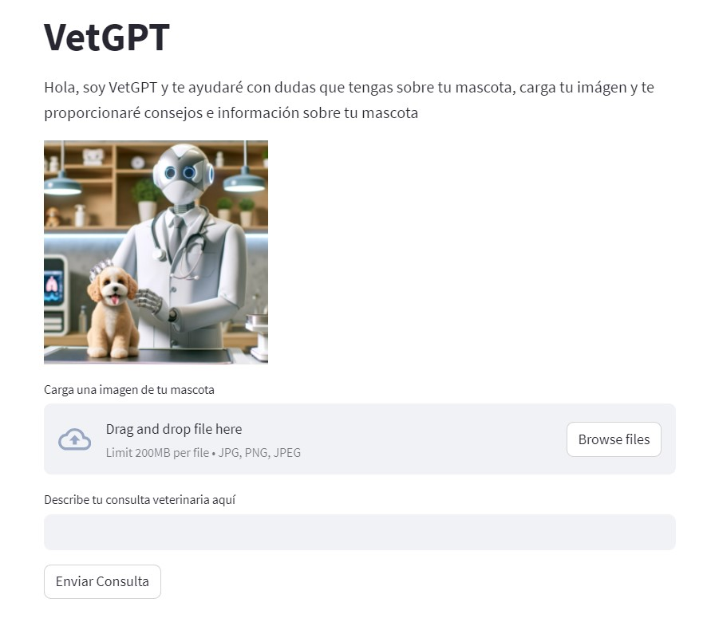

# VetGPT

## Descripción
VetGPT es una aplicación de inteligencia artificial orientada a proporcionar consultas veterinarias virtuales. Utiliza tecnologías avanzadas de procesamiento de imágenes y generación de texto para analizar fotografías de mascotas y responder consultas relacionadas con su salud y bienestar.

## Características
- **Análisis de Imágenes**: Identifica la raza del animal a partir de una imagen cargada y proporciona información relevante.
- **Consultas Veterinarias**: Genera respuestas a preguntas específicas sobre la salud y el cuidado de las mascotas.
- **Descarga de Información**: Permite a los usuarios descargar la información generada como un archivo de texto para su referencia.

## Tecnologías Utilizadas
- Streamlit
- LangChain
- OpenAI's GPT-3.5 y GPT-4 (para el análisis de texto y de imágenes)
- Python

## Instalación y Uso
Para utilizar VetGPT, sigue los siguientes pasos:

1. Clona el repositorio a tu máquina local utilizando `git clone https://github.com/nicoig/VetGPT.git`
2. Instala las dependencias necesarias utilizando `pip install -r requirements.txt`.
3. Inicia la aplicación ejecutando `streamlit run app.py` en tu terminal.

## Contribuciones
Las contribuciones son siempre bienvenidas. Si tienes alguna sugerencia o mejora, no dudes en abrir un 'issue' o hacer un 'pull request'.

## Autor
@NicoIG